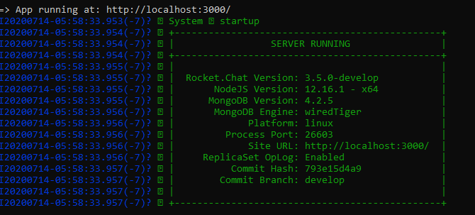
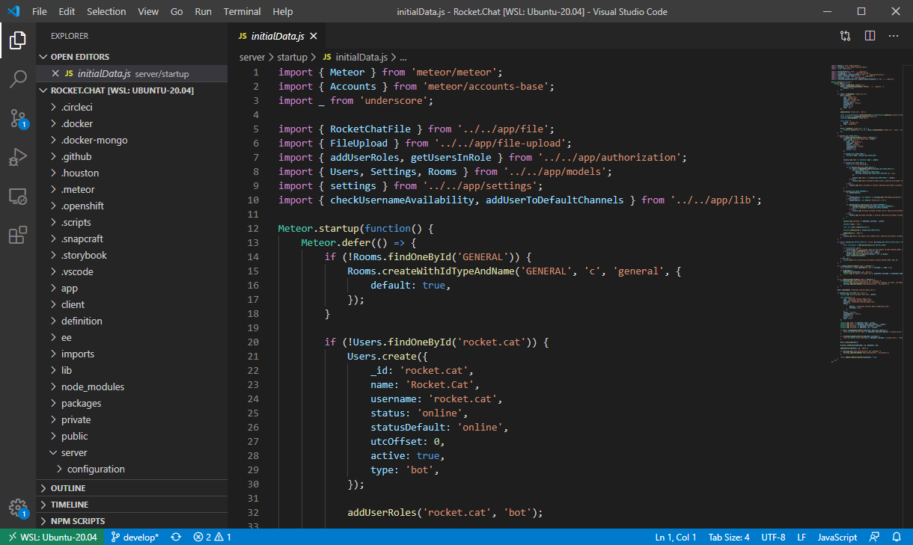

# Developing on Windows 10

Microsoft finally released Windows Subsystem for Linux 2 ([WSL 2](https://docs.microsoft.com/en-us/windows/wsl/wsl2-index)) in June of 2020. Before this time, development of large and complex NodeJS based servers/full-stack applications such as Rocket.Chat on Windows is close to impossible.

WSL 2 is a complete architectural overhaul of Linux on Windows, installing a full genuine Linux kernel (built by Microsoft) alongside the classic Windows kernel. The Linux kernel and Windows kernel can now share system resources, such as memory and CPU, at a granularity not previously possible. It also includes major performance optimization on cross-subsystems file sharing, boot, and other developer-relevant areas.

You must be using **Windows 10, version 2004 or later** to take advantage of WSL 2, and to setup Rocket.Chat development.

## Before you start

The following are prerequisites for developing Rocket.Chat on Windows 10:

1. Make sure you have **Windows 10, version 2004** or later
2. Install and configure **WSL 2** by following [Microsoft documentation,](https://docs.microsoft.com/en-us/windows/wsl/install-win10)  making sure to select **Ubuntu 20.04 LTS** distribution as your choice of Linux
3. Download and install the latest [Linux Kernel Updates](https://docs.microsoft.com/en-us/windows/wsl/wsl2-kernel)

## Machine requirement

Building Rocket.Chat code requires a minimum of 8 GB of RAM memory on the Linux subsystem. (If you are not doing any development, and just deploying a Rocket.Chat server - the RAM required can be as low as 1GB.) On version 2004, about 4 GB of RAM appears to be reserved for the Windows subsystem. You will need a Windows machine with the following minimal requirement to develop Rocket.Chat:

* 12 GB of RAM memory  (16+ GB highly recommended)
* 4 or more cores on CPU (at least 3 GHz boosted,  4.2 GHz or higher recommended)
* 80 GB of available fast SSD storage ( PCIe 4.0 NVMe SSD recommended)

## Setting up development environment

> **IMPORTANT**: Note that there is no need to install mongo, nodejs, or npm separately
>
> **NOTE:** Development should be performed under a regular user account, not Administrator.
>
> **NOTE:** During build, you may notice _WARNING_ related to _peer dependencies_ or other transitive dependencies. They are typically safe to ignore unless you are coding the feature or modules that require them.

1. Open a **WSL 2 shell** (not Powershell). Update Linux `sudo apt-get update sudo apt-get dist-upgrade`
2.  Install tools required

    `sudo apt-get build-essential git curl python-minimal`
3.  Install meteor

    `curl https://install.meteor.com/ | sh`

    (Under some circumstances, you may need to install a specific (older) release of Meteor instead of the latest, always check the `.meteor/release` file of the Github code repository to determine if you need to do this before you install meteor)

    There is no need to install `node` or `npm`, as meteor already includes them. Verify by:

    `meteor node -v`

    `meteor npm -v`
4.  Get rocket.chat code

    `git clone https://github.com/RocketChat/Rocket.Chat.git`

    (you may want to fork the code on Github first, and then clone your fork)
5.  Install modules

    `cd Rocket.Chat`

    `meteor npm install`
6.  Start building (the first build can _take 10 or more minutes_, and you may see various warnings or minor errors -- please be patient; subsequent dev builds after the first will be 5 minutes or less)

    `meteor npm start`

When the server is ready, you will see a box with "Server Running" title:

This means that a Rocket.Chat server is running from your computer. To access the server, use Chrome, Brave, or Firefox browser, and navigate to

`http://localhost:3000`

Other references:

* [Git](https://git-scm.com/book/en/v2/Getting-Started-Installing-Git)
* [Meteor](https://www.meteor.com/install)

## Editing Rocket.Chat Files

On Windows 10, the best coding environment to use is Visual Studio Code. Install [Visual Studio Code](https://code.visualstudio.com/download) from Windows. Make sure you also install the VS Code extension named [Remote - WSL](https://marketplace.visualstudio.com/items?itemName=ms-vscode-remote.remote-wsl) Optionally install the [Windows Terminal](https://www.microsoft.com/en-ca/p/windows-terminal-preview/9n0dx20hk701?rtc=1) extension

Editing files is relatively simple. After you run `git clone`, the files from the repository are saved on your computer. You can go to the cloned repository folder and edit or add files to Rocket.Chat. From a WSL shell, you can start Visual Studio for Code using command `code .` .

When you make changes to Rocket.Chat the server will automatically rebuild.

Sometimes changes can shut down the server, if that happens just run `meteor npm start` again.
